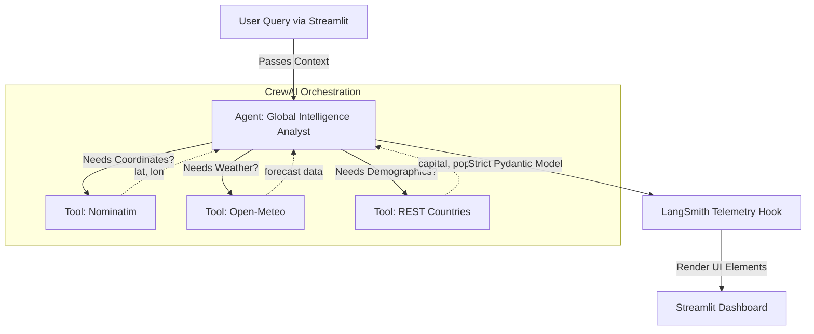

# 🌍 Global Intelligence & Climate Portal

A multi-agent, multi-API research assistant powered by CrewAI, Google Gemini 2.5 Flash, strict Pydantic validation, and a modern Streamlit UI. The agent synthesizes demographic, geographic, and meteorological data using:
- **Open-Meteo** (weather)
- **Nominatim** (geocoding)
- **REST Countries** (demographics)

---

## 🚀 Features
| Feature                        | Description                                                                 |
|---------------------------------|-----------------------------------------------------------------------------|
| Agentic Reasoning               | Multi-step tool chaining with CrewAI                                         |
| Streamlit UI                    | Modern chat interface, metrics, and charts                                  |
| LangSmith Tracing               | End-to-end observability, custom tags, and run metadata                     |
| Strict Pydantic Validation      | All inputs/outputs validated, no extra fields allowed                       |
| Token Usage Optimization        | Minimal prompts, concise outputs, and token tracking                        |
| Modular API Tools               | Each API is a strict, typed CrewAI tool                                     |
| Configurable Prompts            | YAML-based system instructions and task templates                           |

---

## 🗂️ Project Structure

```
qa_agent/
├── main.py              # Streamlit UI entrypoint
├── requirements.txt     # All dependencies
├── README.md            # This file
├── test_api/            # Standalone API test scripts
│   ├── nominatium.py
│   ├── open_meteo.py
│   └── rest_countries.py
└── src/
    ├── __init__.py      # (empty)
    ├── agent.py         # CrewAI agent, task, and output models
    ├── mcp_server.py    # Strict, traced Pydantic API tools
    ├── prompts.yaml     # YAML agent/task config & protocols
    └── config.yaml      # LLM and embedder config
```

---

## 🧠 Architecture & Flow



- **LangSmith** traces all agent/tool runs, with custom tags and feedback.
- **Pydantic** models enforce strict schemas at every step.

---

## 🖥️ Streamlit UI Preview
| Chat interface with history
| Metrics for capital, population, currencies
| 7-day temperature trend chart
| Error and success banners
| Token usage and LangSmith feedback

---

## 🛠️ API Tool Table
| Tool Name         | API Used         | Input Model         | Output Data                | Tracing |
|-------------------|------------------|---------------------|----------------------------|---------|
| geocode_location  | Nominatim        | GeocodeInput        | lat, lon, display_name     | Yes     |
| get_weather       | Open-Meteo       | WeatherInput        | 7-day forecast, summary    | Yes     |
| get_country_data  | REST Countries   | CountryInput        | capital, population, curr. | Yes     |

---

## 📦 Data Models (Pydantic)
| Model                  | Fields                                                      |
|------------------------|-------------------------------------------------------------|
| GeocodeInput           | query: str                                                  |
| WeatherInput           | latitude: float, longitude: float                           |
| CountryInput           | country_name: str                                           |
| CountryDemographics    | capital: str, population: int, currencies: list[str]        |
| IntelligenceBriefing   | location_found: bool, weather_summary: str, demographic_stats: CountryDemographics, raw_forecast: list |

All models are strictly validated (`extra=forbid`) and enforced at every step.

---

## ⚡ Token Usage Optimization
- Prompts and outputs are highly concise
- Only essential context is passed to the LLM
- Strict output schemas prevent verbose or irrelevant completions
- Token usage can be tracked and displayed in the UI

---

## 🔍 LangSmith Observability
| All agent and tool runs are traced (via LangSmith and CrewAI)
| Custom tags: session ID, user query, tool used, error/success
| Feedback and efficiency scoring are attached to each run (see `src/agent.py`)
| Toggle tracing via `LANGSMITH_TRACING` env variable

---

## 🛡️ Strict Pydantic Validation
| All user inputs and API responses are validated
| `extra=forbid` prevents accidental data leakage
| Custom validators for edge cases
| All API tools are strictly typed and traced (see `src/mcp_server.py`)

---

## 🏁 Setup & Usage
1. **Clone the repo**
2. **Create a virtual environment**
3. **Install dependencies**
   ```sh
   pip install -r requirements.txt
   ```
4. **Configure LLM and embedder in `src/config.yaml`**
5. **Run the app**
   ```sh
   streamlit run main.py
   ```

**SSL Note:**
If you encounter SSL certificate errors (especially on corporate networks), the code supports `truststore` injection. Install with `pip install truststore` and it will be used automatically if available.

---

## 💬 Example Questions
| Example Query                                                                 | APIs Used                |
|-------------------------------------------------------------------------------|--------------------------|
| What is the weather in the capital of France?                                 | REST Countries, Nominatim, Open-Meteo |
| Which country is the Colosseum in, and what is its population?                | Nominatim, REST Countries |
| Compare the weather in the capitals of Canada and Australia.                  | REST Countries, Nominatim, Open-Meteo |
| What currency is used in Brazil, and what is the current weather in its capital? | REST Countries, Nominatim, Open-Meteo |

---

## 🧪 API Test Scripts
- `test_api/open_meteo.py`: Standalone weather API test
- `test_api/nominatium.py`: Standalone geocoding API test
- `test_api/rest_countries.py`: Standalone country data test

All test scripts are self-contained and can be run directly for debugging API responses.

---

## 🛠️ Troubleshooting
| Problem                        | Solution                                                      |
|--------------------------------|---------------------------------------------------------------|
| SSL certificate errors         | `pip install certifi` or use truststore injection             |
| CrewAI/LangSmith telemetry     | Set `LANGSMITH_TRACING=false` in your environment             |
| API changes                    | Update tool logic in `src/mcp_server.py`                      |
| Pydantic validation errors     | Check input/output schemas and field types                     |
| YAML config/protocols          | See `src/prompts.yaml` for agent/task logic and operational rules |

---


## 📜 License
MIT License (or specify your license here)

---

## 🙏 Credits
- [Open-Meteo](https://open-meteo.com/)
- [Nominatim](https://nominatim.org/)
- [REST Countries](https://restcountries.com/)
- [CrewAI](https://crewai.com/)
- [Google Gemini](https://ai.google/discover/gemini/)
- [LangSmith](https://smith.langchain.com/)
- [Streamlit](https://streamlit.io/)

---

## Credits
- [Open-Meteo](https://open-meteo.com/)
- [Nominatim](https://nominatim.org/)
- [REST Countries](https://restcountries.com/)
- [CrewAI](https://crewai.com/)
- [Google Gemini](https://ai.google/discover/gemini/)
