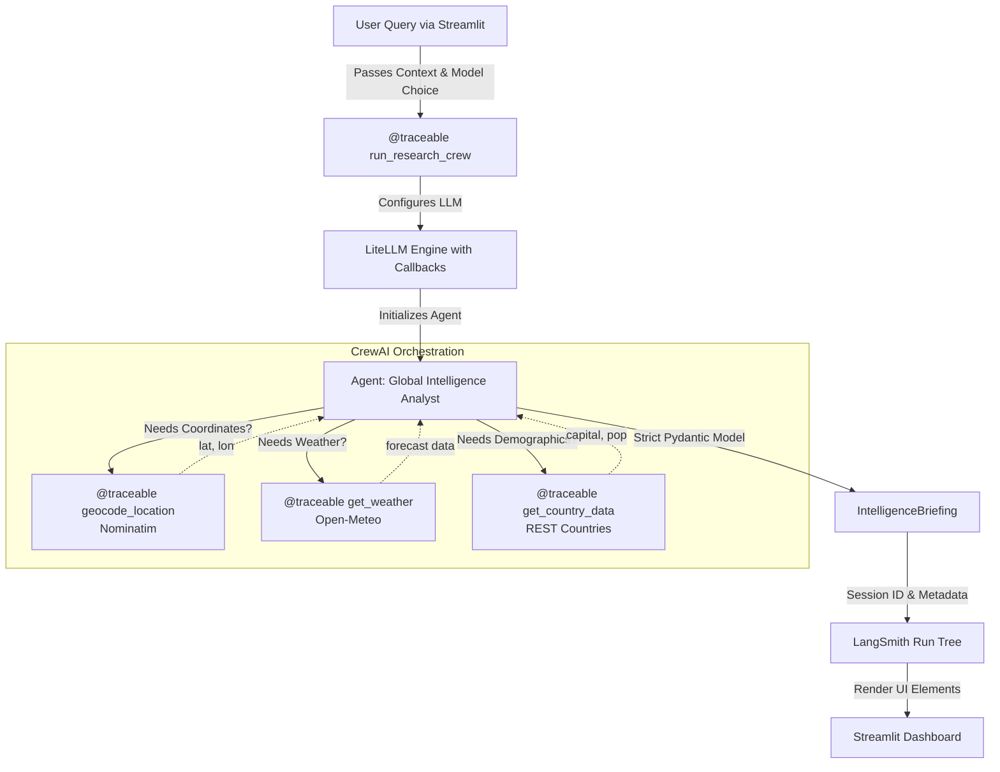

# 🌍 Global Intelligence & Climate Portal

A multi-agent, multi-API research assistant powered by CrewAI, Google Gemini 3.5 Flash (with Groq support), strict Pydantic validation, LiteLLM routing, and a modern Streamlit UI. The agent synthesizes demographic, geographic, and meteorological data using:
- **Open-Meteo** (weather)
- **Nominatim** (geocoding)
- **REST Countries** (demographics)

---

## 🚀 Features
| Feature                        | Description                                                                 |
|---------------------------------|-----------------------------------------------------------------------------|
| Agentic Reasoning               | Multi-step tool chaining with CrewAI                                         |
| Multi-Model Support             | Toggle between Google Gemini and Groq LLM providers via CLI                 |
| Streamlit UI                    | Modern chat interface, metrics, and charts                                  |
| LangSmith Tracing               | Full observability with nested @traceable decorators and LiteLLM callbacks  |
| LangSmith Threading             | Session-based organization for tracking related queries                      |
| Strict Pydantic Validation      | All inputs/outputs validated, no extra fields allowed                       |
| Token Usage Optimization        | Minimal prompts, concise outputs, and token tracking                        |
| Modular API Tools               | Each API is a strict, typed CrewAI tool with tracing                        |
| Configurable Prompts            | YAML-based system instructions and task templates                           |

---

## 🗂️ Project Structure

```
qa_agent/
├── main.py              # Streamlit UI entrypoint
├── requirements.txt     # All dependencies
├── README.md            # This file
├── test_api/            # Standalone API test scripts
│   ├── nominatium.py
│   ├── open_meteo.py
│   └── rest_countries.py
└── src/
    ├── __init__.py      # (empty)
    ├── agent.py         # CrewAI agent, task, and output models
    ├── mcp_server.py    # Strict, traced Pydantic API tools
    ├── prompts.yaml     # YAML agent/task config & protocols
    └── config.yaml      # LLM and embedder config
```

---

## 🧠 Architecture & Flow



**Key Architecture Components:**
- **@traceable Decorator**: Wraps `run_research_crew` and all tool methods to automatically create nested run tree
- **LiteLLM Callbacks**: `litellm.success_callback` and `litellm.failure_callback` push LLM I/O directly to LangSmith
- **Session Threading**: Session ID is added to run metadata, automatically populating "Threads" tab in LangSmith
- **Pydantic Validation**: All inputs/outputs strictly validated with `extra=forbid`
- **Strict Tool Caching**: Geocoding and demographics cached, weather always real-time

---

## 🖥️ Streamlit UI Preview
| Active model selection display (Gemini or Groq)
| Chat interface with history and session context
| Metrics for capital, population, currencies
| 7-day temperature trend chart
| Error and success banners
| Token usage and LangSmith feedback

---

## 🛠️ API Tool Table
| Tool Name         | API Used         | Input Model         | Output Data                | Tracing        | Caching |
|-------------------|------------------|---------------------|----------------------------|-----------------|---------|
| geocode_location  | Nominatim        | GeocodeInput        | lat, lon, display_name     | @traceable      | Yes     |
| get_weather       | Open-Meteo       | WeatherInput        | 7-day forecast, summary    | @traceable      | No      |
| get_country_data  | REST Countries   | CountryInput        | capital, population, curr. | @traceable      | Yes     |

---

## 📦 Data Models (Pydantic)
| Model                  | Fields                                                      |
|------------------------|-------------------------------------------------------------|
| GeocodeInput           | query: str                                                  |
| WeatherInput           | latitude: float, longitude: float                           |
| CountryInput           | country_name: str                                           |
| CountryDemographics    | capital: str, population: int, currencies: list[str]        |
| IntelligenceBriefing   | location_found: bool, weather_summary: str, demographic_stats: CountryDemographics, raw_forecast: list |

All models are strictly validated (`extra=forbid`) and enforced at every step.

---

## ⚡ Token Usage Optimization
- Prompts and outputs are highly concise
- Only essential context is passed to the LLM
- Strict output schemas prevent verbose or irrelevant completions
- Token usage can be tracked and displayed in the UI
- LiteLLM callback system minimizes overhead by batching traces

---

## 📦 Core Dependencies
The `requirements.txt` includes all necessary packages:

| Package       | Purpose                                          |
|---------------|--------------------------------------------------|
| `crewai`      | Multi-agent orchestration framework              |
| `requests`    | HTTP client for API calls                        |
| `pydantic`    | Strict data validation                           |
| `PyYAML`      | Configuration file parsing                       |
| `streamlit`   | UI framework                                     |
| `langsmith`   | Observability and tracing client                 |
| `litellm`     | Unified LLM interface with routing               |
| `certifi`     | SSL certificates (optional, for corporate SSL)   |

Note: `litellm` is imported in `src/agent.py` for automatic LangSmith callback integration.

---

## 🔍 LangSmith Observability & Tracing Architecture
- **Nested Run Trees**: Each tool and the main execution flow are wrapped in `@traceable` decorators
- **Session Threading**: Session IDs are automatically added to run metadata, organizing queries into LangSmith Threads
- **LiteLLM Callbacks**: Success/failure callbacks push all LLM I/O directly to LangSmith without blocking
- **Custom Tags**: Runtime tags include status (success/not_found) and workflow type
- **Feedback Scoring**: Resolution score and metadata attached to each run
- **Run Metadata**: Session ID, location input, weather trigger, and efficiency metrics captured
- **Toggle Tracing**: Set `LANGSMITH_TRACING=true` in environment to enable; defaults to disabled

---

## 📊 LiteLLM Integration & Multi-Model Support
The application uses **LiteLLM** as the unified LLM engine with automatic LangSmith integration:

- **Model Routing**: Seamlessly switch between Google Gemini and Groq via CLI argument
- **Callback Pipeline**: LiteLLM automatically routes LLM calls to LangSmith without blocking
  ```python
  litellm.success_callback = ["langsmith"]
  litellm.failure_callback = ["langsmith"]
  ```
- **Temperature Control**: Set to 0.1 for factual, analytical responses
- **Token Limits**: Configured per model (default: 1024, max: 4096)
- **Credential Management**: Respects environment variables `GEMINI_API_KEY` and `GROQ_API_KEY`

---

## 🔗 Session Management & LangSmith Threads
Each query execution is tagged with a unique `session_id` to organize related queries:

1. Session ID is passed through `run_research_crew` to the `@traceable` decorated wrapper
2. Metadata is injected into the LangSmith Run Tree using `run_tree.add_metadata()`
3. LangSmith automatically populates the **Threads** tab for easy navigation
4. All nested tool calls inherit the session context

---

## 🛡️ Strict Pydantic Validation
| All user inputs and API responses are validated
| `extra=forbid` prevents accidental data leakage
| Custom validators for edge cases
| All API tools are strictly typed and traced (see `src/mcp_server.py`)

---

## 🏁 Setup & Usage
1. **Clone the repo**
2. **Create a virtual environment**
3. **Install dependencies**
   ```sh
   pip install -r requirements.txt
   ```
4. **Configure LLM and embedder in `src/config.yaml`**
   - Default: `gemini-3.5-flash` (Google Gemini)
   - Optional: Set up `GROQ_API_KEY` for Groq support
5. **Set up environment variables:**
   ```sh
   export GEMINI_API_KEY="your-gemini-api-key"
   export GROQ_API_KEY="your-groq-api-key"  # Optional
   export LANGSMITH_TRACING="true"           # Optional, for LangSmith tracing
   ```
6. **Run the app with model selection:**
   ```sh
   # Use Gemini (default)
   streamlit run main.py
   
   # Or use Groq
   streamlit run main.py -- --model groq
   ```

**SSL Note:**
If you encounter SSL certificate errors (especially on corporate networks), the code supports `truststore` injection. Install with `pip install truststore` and it will be used automatically if available. The main.py also includes optional SSL bypass for corporate firewalls.

---

## 💬 Example Questions
| Example Query                                                                 | APIs Used                |
|-------------------------------------------------------------------------------|--------------------------|
| What is the weather in the capital of France?                                 | REST Countries, Nominatim, Open-Meteo |
| Which country is the Colosseum in, and what is its population?                | Nominatim, REST Countries |
| Compare the weather in the capitals of Canada and Australia.                  | REST Countries, Nominatim, Open-Meteo |
| What currency is used in Brazil, and what is the current weather in its capital? | REST Countries, Nominatim, Open-Meteo |

---

## 🧪 API Test Scripts
- `test_api/open_meteo.py`: Standalone weather API test
- `test_api/nominatium.py`: Standalone geocoding API test
- `test_api/rest_countries.py`: Standalone country data test

All test scripts are self-contained and can be run directly for debugging API responses.

---

## 🛠️ Troubleshooting
| Problem                        | Solution                                                      |
|--------------------------------|---------------------------------------------------------------|
| SSL certificate errors         | `pip install certifi` or use truststore injection; SSL bypass in main.py disabled by default |
| CrewAI/LangSmith telemetry     | Set `LANGSMITH_TRACING=true` in environment to enable tracing  |
| API changes                    | Update tool logic in `src/mcp_server.py`                      |
| Pydantic validation errors     | Check input/output schemas and field types in `src/agent.py`   |
| YAML config/protocols          | See `src/prompts.yaml` for agent/task logic and operational rules |
| Model selection issues         | Use `streamlit run main.py -- --model groq` or `--model gemini` |
| LangSmith threading not visible| Ensure `LANGSMITH_API_KEY` is set and `LANGSMITH_TRACING=true`  |

---

## 📜 License
MIT License (or specify your license here)

---

## 🙏 Credits
- [Open-Meteo](https://open-meteo.com/)
- [Nominatim](https://nominatim.org/)
- [REST Countries](https://restcountries.com/)
- [CrewAI](https://crewai.com/)
- [Google Gemini](https://ai.google/discover/gemini/)
- [LangSmith](https://smith.langchain.com/)
- [Streamlit](https://streamlit.io/)

---
